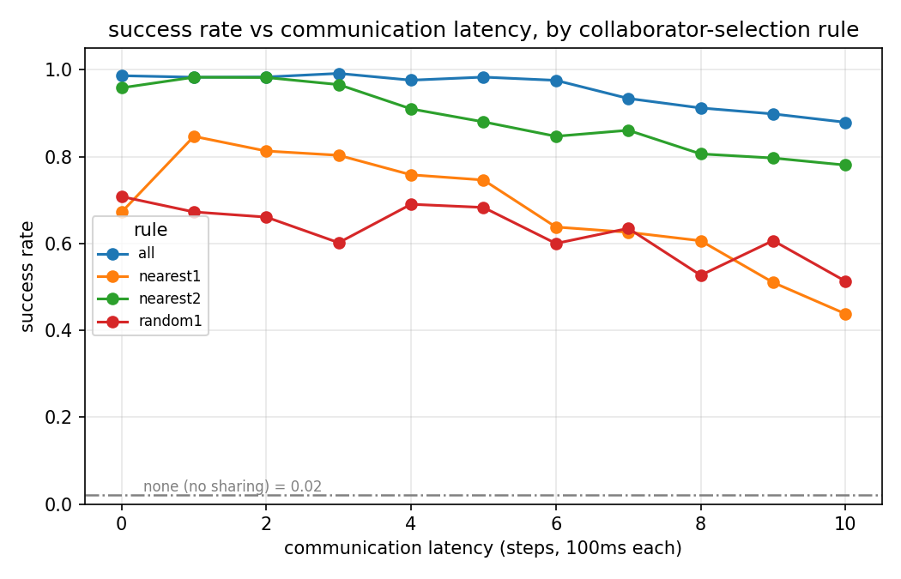
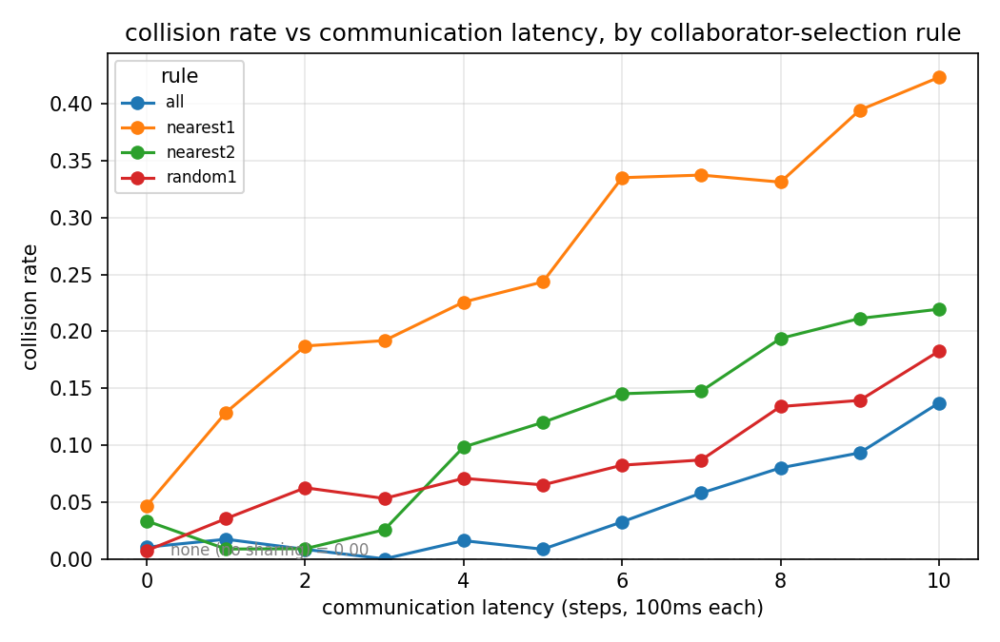
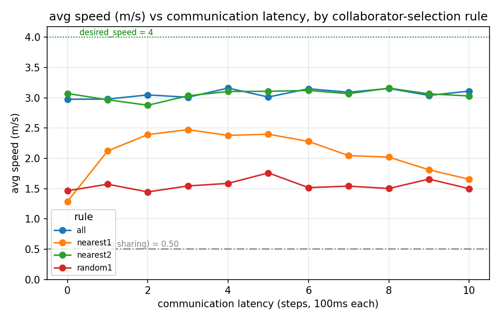

# Communication Latency × Collaborator Selection in Autonomous-Driving Intention Sharing

**Branch**: `coop-intention-latency` · **Platform**: CarDreamer (CARLA 0.9.16 + DreamerV3) · **Scenario**: `carla_right_turn_hard`

---

## TL;DR

In the CarDreamer right-turn-through-traffic scenario, a pretrained DreamerV3 policy is evaluated **zero-shot** across two dimensions of intention sharing: **whose intention is shared** (collaborator-selection rule) × **how stale the intention is** (communication latency, 0–1000 ms). 45 configuration cells total. Key findings:

1. **Redundancy sets the latency-tolerance threshold** — the more collaborators share intention, the more the policy tolerates stale information. Sharing all vehicles (`all`) holds up to ~600 ms; two collaborators (`nearest2`) hit a knee at ~300–400 ms; a single collaborator has almost no tolerance region.
2. **Latency causes "misjudge-and-crash," not "conservative-wait"** — unlike no sharing (`none`, which stalls and times out with near-zero collisions), latency makes the policy act aggressively on stale intentions. Collision rate climbs monotonically with latency (single collaborator: 5% → 42%).
3. **Locked random tracking beats high-frequency nearest switching** — `random1` (lock onto one vehicle and track it) dominates `nearest1` (re-pick the nearest vehicle every step) at high latency, with less than half the collision rate. Supports the "temporal stability of collaborator selection matters" hypothesis.

---

## 1. Background and Motivation

CarDreamer's original intention sharing draws each background vehicle's Traffic-Manager planned trajectory (future waypoints) as an orange line in the ego's bird's-eye view (BEV); the world model's CNN ingests this "where others intend to go" information directly as pixels. The original design makes three idealized assumptions:

- **Zero latency**: at decision time t, the ego receives every other vehicle's plan as of time t.
- **No selection**: either share all (`all`), or coarsely filter by visibility/neighborhood (`visible`/`neighbor`).
- **Ground-truth**: what is shared is the TM's true internal plan, free of prediction error.

In real V2X communication, an intention signal must be encoded → transmitted → decoded, so it is already several time-steps stale by the time the ego decides; and bandwidth/topology mean the ego can only subscribe to a subset of collaborators. This experiment quantifies the effect of these two realistic constraints (**latency** × **selection**) on driving decisions.

---

## 2. Experimental Setup

### 2.1 Scenario and Evaluated Policy

| Item | Configuration |
|---|---|
| Task | `carla_right_turn_hard` (Town03, right turn across dense oncoming traffic, flow gap 6–8 m) |
| Evaluated policy | Official pretrained checkpoint `right_turn_hard.ckpt` (DreamerV3), **zero-shot, no fine-tuning** |
| Background-vehicle observation | `observability: full` (vehicle boxes fully visible, real-time) — the policy stays **in-distribution**, removing the observation-mode OOD confound |
| Desired speed | `desired_speed = 4 m/s` |

**Why full observability of vehicles**: only the **intention channel** (orange lines) is subjected to latency/selection manipulation, while vehicle positions stay fully visible and real-time. This ensures (a) the policy operates in a familiar observation, making the latency/selection effect a clean single variable; and (b) it avoids the high-collision trigger condition of the CARLA 0.9.16 upstream bug (see §5.3).

### 2.2 The Two Experimental Dimensions

**Dimension A — Collaborator-selection rule** (whose intention is shared, `env.intention_sharing.rule`):

| Rule | Meaning |
|---|---|
| `all` | All flow vehicles share intention |
| `nearest2` | The 2 vehicles nearest the ego share |
| `nearest1` | The single nearest vehicle shares (target re-selected every step) |
| `random1` | Randomly lock one vehicle and track it until it despawns, then re-pick |
| `none` | No vehicle shares (no-sharing lower-bound reference) |

**Dimension B — Communication latency** (how stale the intention is, `env.intention_sharing.latency_steps = k`): k ∈ {0,1,…,10}, which at 10 Hz corresponds to **0–1000 ms**.

### 2.3 Latency Mechanism Semantics

Each simulation step buffers an intention snapshot in a `deque(maxlen=k+1)`; the head is exactly the snapshot from step t−k:

- **Orange-line content = the plan as of step t−k** (what the collaborator intended k steps ago);
- **Orange-line anchor = the vehicle's position at step t−k** (the stale broadcast carries the stale position);
- **Local information stays real-time**: vehicle green boxes and the ego's own blue path are not delayed — only the intention arriving over the communication channel is stale.
- Semantic boundary: what is delayed is the "plan content"; `_render_path` automatically trims waypoints the vehicle has already driven past, so the drawn line is "the still-untraveled portion of that stale plan."

k=0 means no latency (the head is the current step). Selection is also delayed with the packet: at step t the ego receives the packet broadcast by the collaborators selected at step t−k.

### 2.4 Evaluation Protocol

- Each cell runs **20 000 environment steps** (~110–290 episodes), policy uses deterministic (zero-entropy) sampling;
- Metrics recorded: success rate (destination-reached rate), collision rate, timeout rate, average speed, average return;
- Single seed; success-rate SEM ≈ **±3–4%** (read trends, do not compare point-by-point).

### 2.5 Matrix Design (45 cells)

- Main matrix: {`all`, `nearest2`, `nearest1`, `random1`} × k∈{0..10} = 44 cells;
- `none` reference, 1 cell (no latency dimension).

---

## 3. Results

### 3.1 Success Rate (%)

| rule | k0 | k1 | k2 | k3 | k4 | k5 | k6 | k7 | k8 | k9 | k10 |
|---|---|---|---|---|---|---|---|---|---|---|---|
| all | 99 | 98 | 98 | 99 | 98 | 98 | 98 | 93 | 91 | 90 | 88 |
| nearest2 | 96 | 98 | 98 | 97 | 91 | 88 | 85 | 86 | 81 | 80 | 78 |
| nearest1 | 67 | 85 | 81 | 80 | 76 | 75 | 64 | 63 | 61 | 51 | 44 |
| random1 | 71 | 67 | 66 | 60 | 69 | 68 | 60 | 63 | 53 | 61 | 51 |
| none | 2 (reference) | | | | | | | | | | |



### 3.2 Collision Rate (%)

| rule | k0 | k1 | k2 | k3 | k4 | k5 | k6 | k7 | k8 | k9 | k10 |
|---|---|---|---|---|---|---|---|---|---|---|---|
| all | 1 | 2 | 1 | 0 | 2 | 1 | 3 | 6 | 8 | 9 | 14 |
| nearest2 | 3 | 1 | 1 | 3 | 10 | 12 | 15 | 15 | 19 | 21 | 22 |
| nearest1 | 5 | 13 | 19 | 19 | 23 | 24 | 34 | 34 | 33 | 39 | 42 |
| random1 | 1 | 4 | 6 | 5 | 7 | 7 | 8 | 9 | 13 | 14 | 18 |
| none | 0 (reference, see §5.2) | | | | | | | | | | |



### 3.3 Timeout (%)

| rule | k0 | k1 | k2 | k3 | k4 | k5 | k6 | k7 | k8 | k9 | k10 |
|---|---|---|---|---|---|---|---|---|---|---|---|
| all | 0 | 0 | 0 | 0 | 0 | 0 | 0 | 0 | 0 | 0 | 0 |
| nearest2 | 0 | 0 | 0 | 0 | 0 | 0 | 0 | 0 | 0 | 0 | 0 |
| nearest1 | 30 | 1 | 0 | 0 | 1 | 0 | 2 | 2 | 5 | 8 | 12 |
| random1 | 28 | 28 | 27 | 33 | 23 | 24 | 31 | 25 | 33 | 25 | 30 |
| none | 97 (reference) | | | | | | | | | | |

### 3.4 Average Speed (m/s, desired_speed=4)

| rule | k0 | k1 | k2 | k3 | k4 | k5 | k6 | k7 | k8 | k9 | k10 |
|---|---|---|---|---|---|---|---|---|---|---|---|
| all | 2.98 | 2.98 | 3.05 | 3.01 | 3.16 | 3.01 | 3.15 | 3.09 | 3.15 | 3.04 | 3.11 |
| nearest2 | 3.07 | 2.97 | 2.88 | 3.03 | 3.10 | 3.11 | 3.12 | 3.07 | 3.16 | 3.06 | 3.03 |
| nearest1 | 1.29 | 2.12 | 2.39 | 2.47 | 2.38 | 2.40 | 2.28 | 2.04 | 2.02 | 1.81 | 1.65 |
| random1 | 1.46 | 1.57 | 1.45 | 1.54 | 1.59 | 1.76 | 1.52 | 1.54 | 1.50 | 1.66 | 1.50 |
| none | 0.50 (reference) | | | | | | | | | | |



### 3.5 Sample Size (episodes per cell)

| rule | k0 | k1 | k2 | k3 | k4 | k5 | k6 | k7 | k8 | k9 | k10 |
|---|---|---|---|---|---|---|---|---|---|---|---|
| all | 292 | 116 | 120 | 118 | 125 | 118 | 123 | 121 | 125 | 118 | 124 |
| nearest2 | 120 | 116 | 112 | 117 | 122 | 125 | 124 | 122 | 129 | 123 | 123 |
| nearest1 | 128 | 163 | 187 | 198 | 186 | 193 | 185 | 163 | 160 | 147 | 137 |
| random1 | 137 | 113 | 112 | 113 | 113 | 123 | 170 | 115 | 112 | 122 | 115 |
| none | 99 | | | | | | | | | | |

---

## 4. Analysis and Findings

### Finding 1: Redundancy sets the "latency-tolerance threshold" (strongest result)

Every collaborator scale has a latency knee beyond which performance collapses, and the **knee shifts monotonically right with the number of collaborators**:

| Collaborator scale | Latency knee | Success @ k=10 | Collision @ k=10 |
|---|---|---|---|
| `all` (all) | ~k=6 (600 ms) | 88% | 14% |
| `nearest2` (2) | ~k=3–4 (300–400 ms) | 78% | 22% |
| `nearest1` (1) | almost no tolerance | 44% | 42% |

**Mechanism**: more collaborators means more redundant intention information — when one intention is stale, others still fill in, so the policy's gap judgment does not fail. This quantitative "redundancy ↔ latency-tolerance" relationship is directly actionable for system design: **given a channel latency budget, one can back out the minimum number of collaborators to subscribe to.**

### Finding 2: Latency causes "misjudge-and-crash," not "conservative-wait"

Contrast the two failure modes:

- **No sharing** (`none`): 97% timeout, ~0% collision, speed only 0.50 m/s — the policy stalls at the intersection, afraid to merge, "safely paralyzed";
- **Delayed sharing** (single collaborator): collision rate climbs monotonically with latency (`nearest1`: 5% → 42%), timeout stays low.

That is: **missing information makes the policy conservative (wait); stale information makes it aggressively misjudge (crash)**. The latter is more dangerous — at k=10 (1 s latency) `nearest1` collides at 42%, worse than no sharing at all. A stale intention gives the ego a false-optimistic signal that "traffic has yielded a gap," so it accelerates into a gap that no longer exists.

### Finding 3: Locked random tracking beats high-frequency nearest switching

In the high-latency regime, `random1` (lock onto one vehicle and track it) **dominates** `nearest1` (re-pick the nearest vehicle every step):

| Metric @ k=10 | nearest1 | random1 |
|---|---|---|
| Success | 44% | 51% |
| Collision | 42% | **18%** |
| Speed | 1.65 (volatile) | 1.50 (steady) |

**Mechanism**: `nearest1` switches its shared target every step; layered on top of latency, the orange line jumps between vehicles, making the intention signal temporally incoherent and hard for the policy to base a stable judgment on. `random1` locks onto one vehicle, so the signal is temporally continuous and latency merely translates the whole trajectory, keeping behavior predictable. This directly supports the hypothesis that **the temporal stability of collaborator selection matters as much as instantaneous relevance** — greedily picking the "currently most relevant" vehicle every step is not necessarily better than stably tracking a suboptimal target.

### Finding 4: Speed draws three clear "information-sufficiency" bands

The speed chart (§3.4) separates three bands more intuitively than success/collision:

- **Upper band (~3.0 m/s)**: `all` + `nearest2` nearly coincide and stay flat — with ≥2 collaborators the policy drives confidently, latency-immune;
- **Middle band (1.3–2.5, inverted-U)**: `nearest1`'s speed rises then falls. The rising segment (k0→3) "getting faster" is not getting better but getting reckless — it rises in lockstep with collision rate while success rate falls, together forming the full picture of "stale information induces aggressive misjudgment";
- **Lower band (~1.5, steady)**: `random1` slow but steady;
- **Floor (0.50)**: `none` stalled.

The obvious gap between the upper band and the middle/lower bands is the dividing line of "is the intention information sufficient."

### Synthesis: a behavioral atlas from the four metrics together

| Collaborator scale | Speed | Success | Collision | Main failure mode | Behavioral profile |
|---|---|---|---|---|---|
| ≥2 collaborators | fast (~3.0) | high | low | — | confident, latency-immune (below the knee) |
| 1 collaborator (nearest switching) | medium, reckless w/ latency | mid→low | **explodes** | collision | stale info → aggressive misjudgment |
| 1 collaborator (random lock) | slow but steady | mid→low | mild | timeout + few collisions | conservative but predictable |
| No sharing (none) | stalled (0.5) | 2% | ~0 | timeout | safe paralysis, afraid to move |

---

## 5. Methodological Notes and Limitations

### 5.1 Statistical power
Single seed, ~110–290 episodes per cell, success-rate SEM ≈ ±3–4%. Small fluctuations between adjacent k values (e.g. `nearest1`'s 85→81→80) are within noise; read **trends**, not individual points. Multiple seeds would tighten the error bars and pinpoint the knees.

### 5.2 Two points requiring careful interpretation
- **`none`'s ~0% collision is misleading**: it collides ~0% not because it drives well but because it stalls (97% timeout). So collision rate is not a meaningful "lower bound" for `none`; its meaningful reference is the 2% floor on success rate.
- **Code-path inconsistency in the k=0 column**: the k=0 data for `all`/`nearest1`/`random1`/`none` were run with the earlier v1 code (query at render time), while k≥1 used the v2 code (post-tick cache + comm_packet). Evidence is the abrupt failure-mode shift in `nearest1` from k0→k1: timeout 30%→1%, success 67%→85%, collision 5%→13% — this discontinuity is partly a code-path artifact rather than a true latency effect. **Recommendation**: re-run the 4 seeded k=0 cells with the v2 code (~30 min) to make the column comparable.

### 5.3 CARLA 0.9.16 upstream-bug workaround
CARLA 0.9.16's Traffic Manager `get_all_actions` has a use-after-free in the vehicle-destroy window (confirmed by gdb C++ stack: `LocalizationStage::ComputeActionBuffer → SimpleWaypoint::GetRoadOption` dereferencing a dangling pointer), which segfaults under "collision churn × full-stack concurrency × high-frequency querying." The latency mechanism must query the TM once per step and cannot drop it; the fix moves that query into the **safe window** in `WorldManager.step()`, after `tick()` and before `on_step()` (destroys), and caches it (the 7-line fix in world_manager.py). This is a necessary workaround for the upstream bug, not a removable patch. The CARLA version is a hard constraint and cannot be changed.

---

## 6. Reproduction

```bash
cd <repo>            # coop-intention-latency branch
conda activate cardreamer
export CARLA_ROOT=/home/peh324/carla_simulator   # CARLA 0.9.16

# A single cell (example: share only the nearest 1 vehicle, 200 ms latency)
bash eval_dm3.sh 2000 0 ./checkpoints/CarDreamer_checkpoints/right_turn_hard.ckpt \
  --task carla_right_turn_hard \
  --env.observation.birdeye_wpt.waypoint_obs designated \
  --env.intention_sharing.rule nearest --env.intention_sharing.num 1 \
  --env.intention_sharing.latency_steps 2 \
  --dreamerv3.run.steps 2e4

# Full matrix (45 cells, ~5–6 h, with hang/crash watchdogs)
bash run_latency_matrix.sh

# Analysis and figures
python analyze_coop_matrix.py --outdir logdir/eval/latency
```

Note: `checkpoints/` (HuggingFace weights, `hf download ucd-dare/CarDreamer ...`) and `logdir/` (evaluation data) are not tracked in git.

---

## 7. Deliverables

| File | Content |
|---|---|
| `experiments/coop-intention-latency/coop-intention-latency.md` | This report (Markdown) |
| `experiments/coop-intention-latency/coop-intention-latency.docx` | This report (Word) |
| `experiments/coop-intention-latency/coop_matrix_results.csv` | Raw summary data for all 45 cells |
| `experiments/coop-intention-latency/figures/success_vs_latency.png` | Success-rate vs latency (4 rules + none reference) |
| `experiments/coop-intention-latency/figures/collision_vs_latency.png` | Collision-rate vs latency |
| `experiments/coop-intention-latency/figures/speed_vs_latency.png` | Speed vs latency (+ desired_speed reference) |

Key code: `car_dreamer/carla_wpt_fixed_env.py` (selection + latency buffer), `car_dreamer/toolkit/observer/handlers/renderer/birdeye_renderer.py` (intention/collaborator-vehicle rendering), `car_dreamer/toolkit/carla_manager/world_manager.py` (TM-segfault workaround), `run_latency_matrix.sh` + `analyze_coop_matrix.py` (experiment orchestration + analysis).
